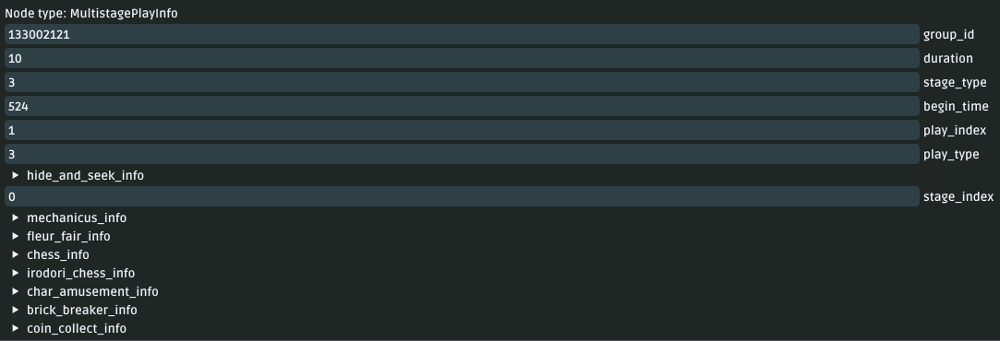
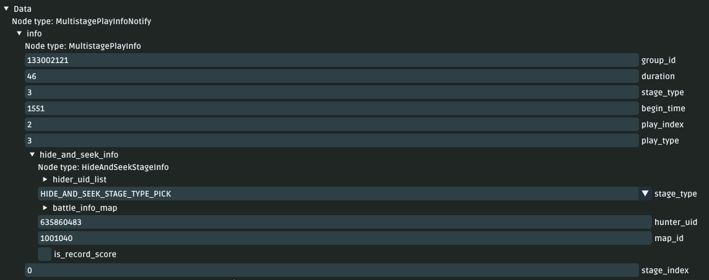
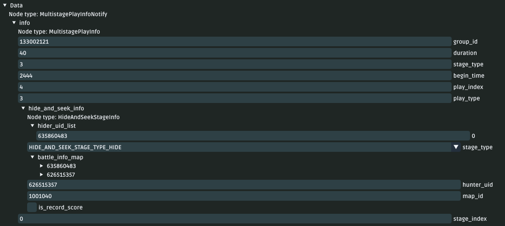
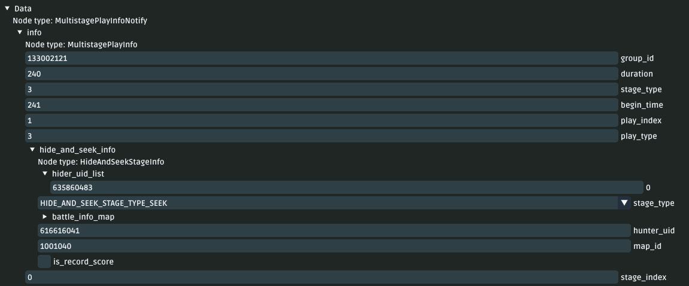
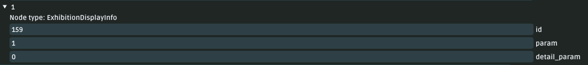

# Hide and Seek!
Documentation on how the **Hide and Seek** game works.\
Externally dubbed: `Windtrace`.

# Map IDs
TODO: Document the map IDs of Windtrace.

TODO: Investigate `ServerGlobalValueChangeNotify`

# Asking Players to Play in a Co-Op Game
1. The client will send `DraftOwnerStartInviteReq`
2. The server will send `DraftOwnerInviteNotify` to all clients.
3. The server will send `DraftOwnerStartInviteRsp`

# Matching in a Co-Op Game
1. World owner talks to Gygax and begins a Windtrace game.
2. The packet `DraftOwnerInviteNotify` is sent to clients.
3. Clients will respond with `DraftGuestReplyInviteReq` (client-side)
4. The server will respond with `DraftGuestReplyInviteRsp`
5. The server will respond with `DraftInviteResultNotify`

# Starting Windtrace
1. If `DraftInviteResultNotify` is a success, the server will send a series of packets.
   1. A series of `SceneEntityAppearNotify` packets.
   2. `NpcTalkStateNotify`
   3. `PlayerEnterSceneNotify`
   4. `MultistagePlayInfoNotify`
2. The players are then teleported to the Windtrace map in their locations.
3. Server will send packets to clients. (this is server boilerplate)
4. The server sends another `MultistagePlayInfoNotify` to clients.

# Changing Avatars - Others
1. The server will send a `AvatarEquipChangeNotify` packet to clients.
2. The server will send a `SceneTeamUpdateNotify` packet to clients.
3. The server will send a `HideAndSeekPlayerSetAvatarNotify` packet to clients.

# Getting Ready
1. The client will send `HideAndSeekSetReadyReq` to the server.
2. The server will reply with `HideAndSeekPlayerReadyNotify` to clients.
3. The server will send `MultistagePlayInfoNotify` to clients.
4. The server will reply with `HideAndSeekSetReadyRsp` to the client.
5. If all players are ready, the server will move on to start Windtrace.

# Starting Windtrace
1. When all players are ready, the server will send a series of packets to players.
   1. `GalleryStartNotify`
   2. `SceneGalleryInfoNotify`
   3. `MultistagePlayInfoNotify`
   4. `MultistagePlayStageEndNotify`
   5. This will only get sent at the `1.` countdown.

### Notes:
- `GuestReplyInviteRsp` is sent **after** `DraftInviteResultNotify`.

## `DraftOwnerInviteNotify`
- `invite_deadline_time` - This is the time when the invite expires.
- `draft_id` - The value is always `3001` for Windtrace.

## `DraftOwnerStartInviteReq`
- `draft_id` - The value is always `3001` for Windtrace.

## `DraftOwnerStartInviteRsp`
- `draft_id` - The value is always `3001` for Windtrace.
- `invite_fail_info_list` - A list of players who weren't invited.
- `retcode` - The response code.
- `wrong_uid` - Always `0`. (undocumented)

## `DraftGuestReplyInviteReq`
- `draft_id` - The value is always `3001` for Windtrace.
- `is_agree` - A boolean value for whether the client accepts the invite.

## `DraftGuestReplyInviteRsp`
- `draft_id` - The value is always `3001` for Windtrace.
- `retcode` - Response code for the request.
- `is_agree` - A boolean value for whether the server acknowledges the client's invite acceptation.

## `DraftInviteResultNotify`
- `draft_id` - The value is always `3001` for Windtrace.
- `is_all_agree` - A boolean value for whether all clients accepted the invite.

## `NpcTalkStateNotify`
- `is_ban` - This value is always true when entering Windtrace.

## `PlayerEnterSceneNotify`
- `pos` - This is where the player will be teleported to.
  - This value depends on if the player is a hunter or a runner.
  - This value is set by the server and must be hardcoded/read from a JSON file.

## `MultistagePlayStageEndNotify`
- `play_index` - Value picked by the server. (use 1)
- `group_id` - This value is always `133002121` for Windtrace.

## `MultistagePlayInfoNotify` - Initial + PostEnterSceneReq
- Image Reference: 
- `info` - MultistagePlayInfo data.
  - `group_id` - The value is always `133002121` for Windtrace.
  - `play_index` - Value picked by the server. (use 1)
  - `hide_and_seek_info` - Information about Windtrace.
    - `hider_uid_list` - A list of UIDs (ints) of the hiders.
    - `hunter_uid` - The UID (int) of the hunter.
    - `map_id` - The ID of the Windtrace map.
    - `stage_type` - Windtrace state.
      - This will be `HIDE_AND_SEEK_STAGE_TYPE_PREPARE`.
    - `battle_info_map` - Contains a dictionary of UID -> `HideAndSeekPlayerBattleInfo` objects.
      - `skill_list` - Array of 3 values of skill IDs chosen by the player.
      - `avatar_id` - The ID of the avatar the player wants to use.
      - `is_ready` - The player's in-game ready state.
      - `costume_id` - The costume the player's avatar is wearing.

## `MultistagePlayInfoNotify` - Picking Avatars
- Image Reference: 
- **Note:** This packet matches the initial structure and data.
- `info.hide_and_seek_info.stage_type` - This will be `HIDE_AND_SEEK_STAGE_TYPE_PICK`.

## `MultistagePlayInfoNotify` - Starting Windtrace
- Image Reference: 
- **Note:** This packet matches the initial structure and data.
- `info.hide_and_seek_info.stage_type` - This will be `HIDE_AND_SEEK_STAGE_TYPE_HIDE`.

## `MultistagePlayInfoNotify` - Seeking Time
- Image Reference: 
- **Note:** This packet matches the initial structure and data.
  - `info.hide_and_seek_info.stage_type` - This will be `HIDE_AND_SEEK_STAGE_TYPE_SEEK`.

## `MultistagePlayInfoNotify` - Finish Windtrace
- Image Reference: 
- **Note:** This packet matches the initial structure and data.
    - `info.hide_and_seek_info.stage_type` - This will be `HIDE_AND_SEEK_STAGE_TYPE_SETTLE`.

## `HideAndSeekPlayerSetAvatarNotify`
- `avatar_id` - The ID of the new avatar the player wants to use.
- `uid` - The UID of the player who changed their avatar.
- `costume_id` - The costume the player's avatar is wearing.

## `HideAndSeekSetReadyRsp`
- `retcode` - Response code for the request.

## `HideAndSeekPlayerReadyNotify`
- `uid_list` - A list of UIDs (ints) of the players who are ready.

## `GalleryStartNotify`
- `gallery_id` - TODO: Check if this value is always `7056` for Windtrace.
- `start_time` - This value is always `2444` for Windtrace.
  - This value is `200` when displaying game end statistics.
- `owner_uid` - The UID of the player who started the Windtrace game.
- `player_count` - The number of players in the Windtrace game.
- `end_time` - This value is always the same as `start_time`.

## `SceneGalleryInfoNotify` - Starting Windtrace
- `gallery_info` - SceneGalleryInfo data.
  - `end_time` - This value is always the same as `start_time`.
  - `start_time` - This value is always `2444` for Windtrace.
    - This value is `200` when displaying game end statistics.
  - `gallery_id` - This value is always the same as `gallery_id` from `GalleryStartNotify`.
  - `stage` - The current stage of the gallery.
    - This will be `GALLERY_STAGE_TYPE_START`.
  - `owner_uid` - The UID of the player who started the Windtrace game.
  - `hide_and_seek_info` - SceneGalleryHideAndSeekInfo
    - `visible_uid_list` - List of UIDs (ints) of the players who were left alive.
    - `caught_uid_list` - List of UIDs (ints) of the players who have been caught.
  - `player_count` - The amount of players in the Windtrace game.
  - `pre_start_end_time` - This value is always `0` for Windtrace.

## `HideAndSeekSettleNotify`
- `reason` - The reason for the game ending.
- `winner_list` - A list of UIDs (ints) of the players who won the game.
- `settle_info_list` - HideAndSeekSettleInfo data.
  - This is a list of players who participated in the game.

## `HideAndSeekSettleInfo`
- `card_list` - A collection of `ExhibitionDisplayInfo`
  - If unknown: hardcode the specified values. 
  - These values are repeated during testing.
- `uid` - The UID of the player who participated in the game.
- `nickname` - The player's nickname.
- `head_image` - This value is always `0`.
- `online_id` - This value is always blank.
- `profile_picture` - `ProfilePicture` object.
- `play_index` - Value picked by the server. (use 1)
- `stage_type` - The stage type. (inconclusive; TODO)
- `cost_time` - The amount of time the player took to complete the game.
- `score_list` - A list of player scores.

## `ExhibitionDisplayInfo`
- `id` - The ID of the reward.
- `param` - The amount of the reward given.
- `detail_param` - This value is *mostly* 0.
  - This value **matches** param when the reward is of the amount of time spent playing. (participation reward)
